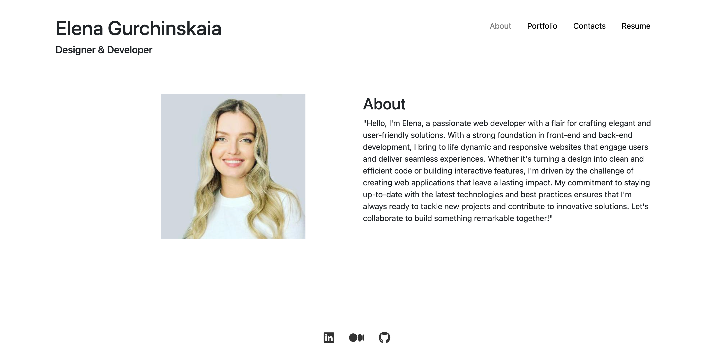

# Elena's Portfolio

## Description

Developed a single-page portfolio application showcasing a web developer's skills and projects. Features include a dynamic navigation menu, sections for About Me, Portfolio, Contact, and Resume, with responsive design. The portfolio displays recent projects with links to both deployed applications and GitHub repositories. It also includes a contact form with validation and a downloadable resume, enhancing the developer's online presence and accessibility.

## Table of Contents

- [Description](#description)
- [Key Features](#key-features)
- [Technology Used](#technology-used)
- [Deployment](#deployment)
- [GitHub Repo](#eg-react-portfolio)
- [License](#e-commerce-back-end)
- [Contributing](#contributing)
- [Questions](#questions)

## Key Features

- Dynamic Navigation Menu
- Interactive Highlighting
- Contact Form with Validation
- Portfolio Showcase
- Resume Section

## Technology Used

- [React](https://react.dev/)
- [JavaScript](https://developer.mozilla.org/en-US/docs/Web/JavaScript)
- [CSS](https://developer.mozilla.org/en-US/docs/Web/CSS)
- [Bootstrap](https://getbootstrap.com/)
- [Email.js](https://www.emailjs.com/)
- [Netlify](https://www.netlify.com/)

## Deployment

[Elena's portfolio](https://main--benevolent-hummingbird-60f64b.netlify.app/about)

## GitHub Repo

[eg-react-portfolio](https://github.com/elenagurchinskaia/eg-react-portfolio)

## Installation

N/A

## Contributing

N/A

## Questions

For any questions or inquires, feel free to reach out to me via GitHub:
[elenagurchinskaia](https://github.com/elenagurchinskaia) or Email: elenagurchinskaia@gmail.com.
